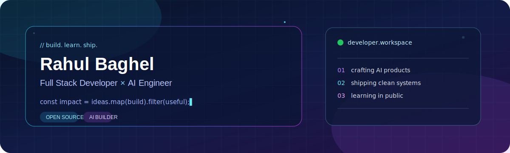
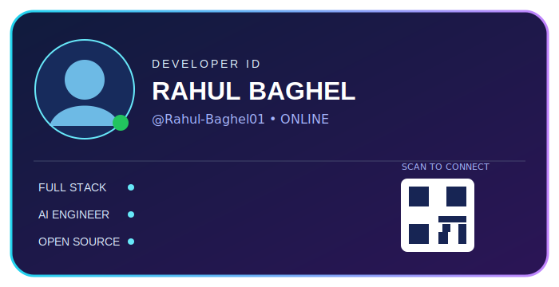
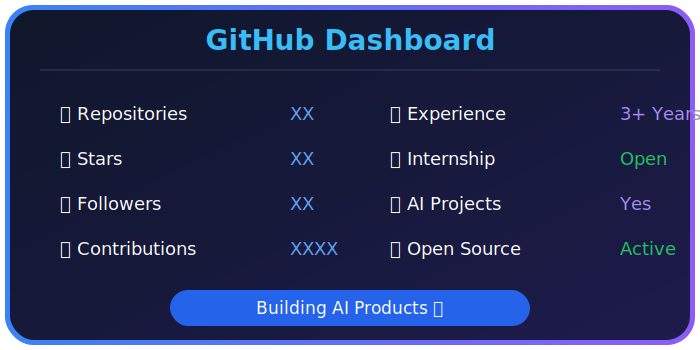
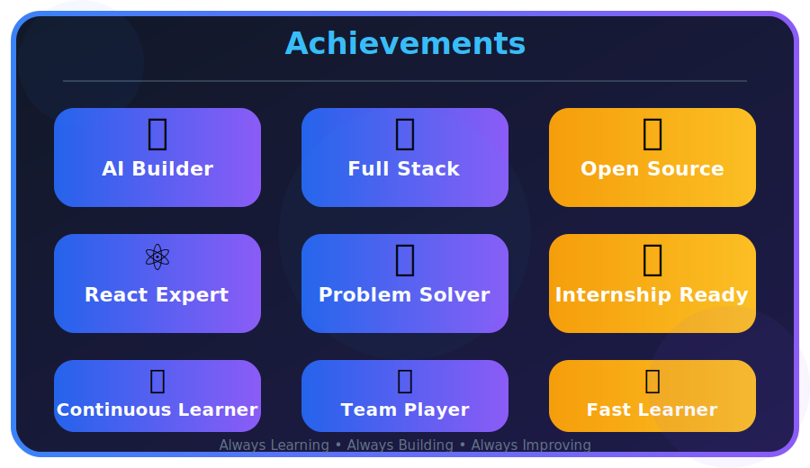

<picture>
  <source media="(prefers-color-scheme: dark)" srcset="./assets/banner-dark.svg">
  <source media="(prefers-color-scheme: light)" srcset="./assets/banner-light.svg">
  
</picture>

 

<table>
<tr>

<td width="35%" align="center">

</td>

<td width="65%">

# 👋 Hi, I'm Rahul Baghel

### 🚀 Full Stack Developer

I'm a B.Tech student passionate about building modern web applications and AI-powered products.

### 🌱 Currently Working On

- 🤖 PrepWise AI Interviewer
- 💬 SecureChat
- 🌸 Women's Health Tracker

### 💻 Tech Stack

- React
- Next.js
- Node.js
- Express
- MongoDB
- Java
- Firebase
- Tailwind CSS
- OpenAI
- Gemini
- Vapi AI

> Building intelligent software that solves real-world problems.

</td>

</tr>
</table>

---

# 🚀 Featured Projects

| Project | Description |
|---------|-------------|
| 🤖 PrepWise AI | AI Interview Platform with Voice & Resume Analysis |
| 💬 SecureChat | Real-Time Chat Application |
| 🌸 Women's Health Tracker | AI-powered Women's Healthcare Platform |

---

## 📊 GitHub Dashboard

---

## 🔥 GitHub Streak

---

## 📈 Contribution Graph

---

## 🏆 Achievements

---

## 🐍 Contribution Snake

---

## 🌐 Connect With Me

---

⭐ Thanks for visiting my profile!

